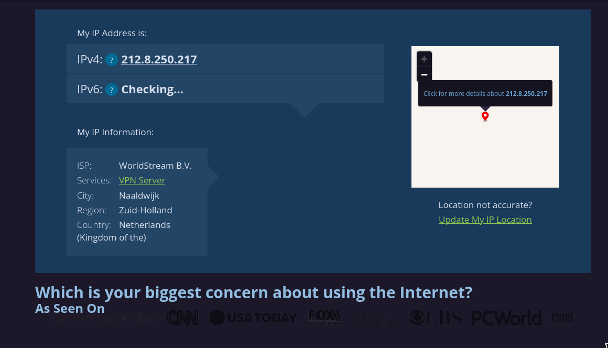

# Day 8: VPN 

## Installation 

I have decided to use protonvpn as I already have a free account in it. Although protonvpn has a CLI client called ```protonvpn-cli```, I have decided to use openvpn as its configuration is more transparent. openvpn was installed from the official repository using the following command: 

```yay -S openvpn```


## VPN Configuration 

Since openvpn is being used as the client, the openvpn configuration files need to be obtained from the dashboard to establish a connection to the vpn server. 


A few configuration files from the free Netherland server was downloaded. Proton VPN also requires authentication to establish a connection to the server. The credentials were also obtained a put in a file named ikev2. Then the following command was used to establish a connection to the server. 

```sudo openvpn --config nl-free-09.protonvpn.udp.ovpn --auth-user-pass ikev2```

After a connection was established, whatismyipaddress.com was visited to verify the IP address and location. I also browsed a few more sites to ensure that the connection was both stable and encrypted



Since the connection is established to a Proton VPN free server, the speed of the connection might have been significantly reduced. A program called speedtest-cli was used to compare connection speeds with and without VPN. 

 

 

As the speedtest output shows, there was a significant reduction in speed when the system was using the protonvpn free server. 


## VPN Benifits and Limitations 

The two major advantages of using VPN is that it hides your real public facing IP address and ensures that your connection is encrypted when browsing various sites. VPN can sometimes also be used to bypass certain regional restrictions to content and allows for a secure remote access. 

However, as was shown previously, using a VPN significantly affects internet speeds. This can be circumvented by upgrading to Pro services in VPN or using a custom VPS. Although your IP address is masked, a VPN does not guarantee total anonymity. A particular site can still track you using other techniques such as "cookie fingerprinting". Using a VPN also confers a certain level of trust to the provider who, depending on their policies, might log VPN traffic.

